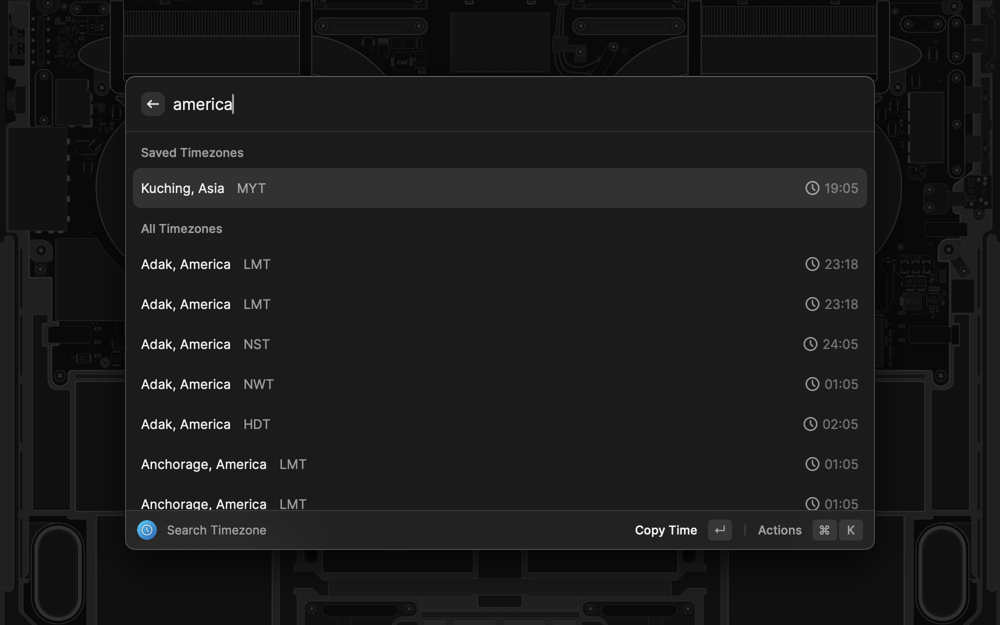
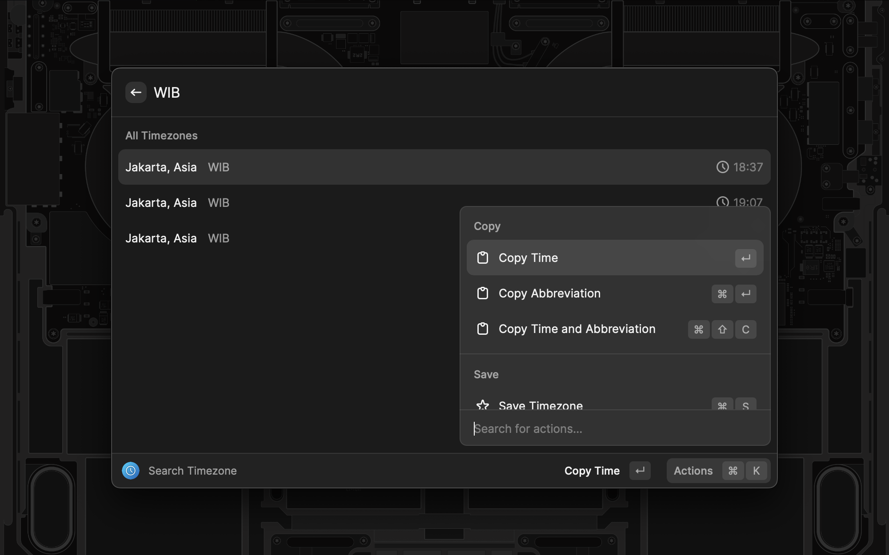

<h1 align="center">Timezones</h1>
<h3 align="center">
Search and save worldwide timezone locally from your command bar. 
</h3>

No internet connection is needed. Timezone data by <a href="https://timezonedb.com" target="_blank">TimezoneDB</a>

